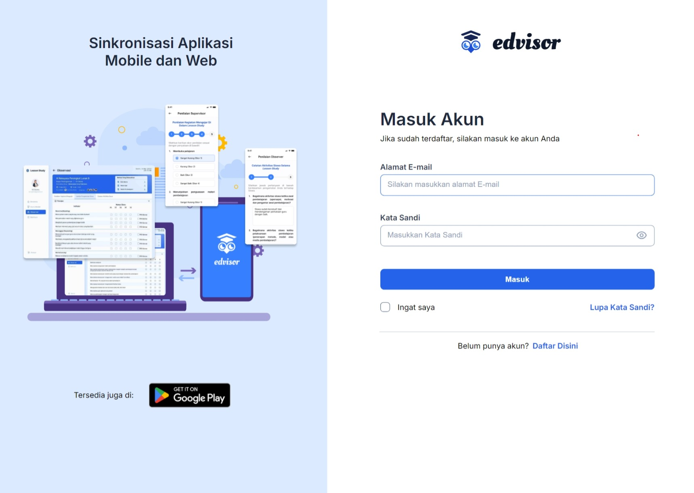
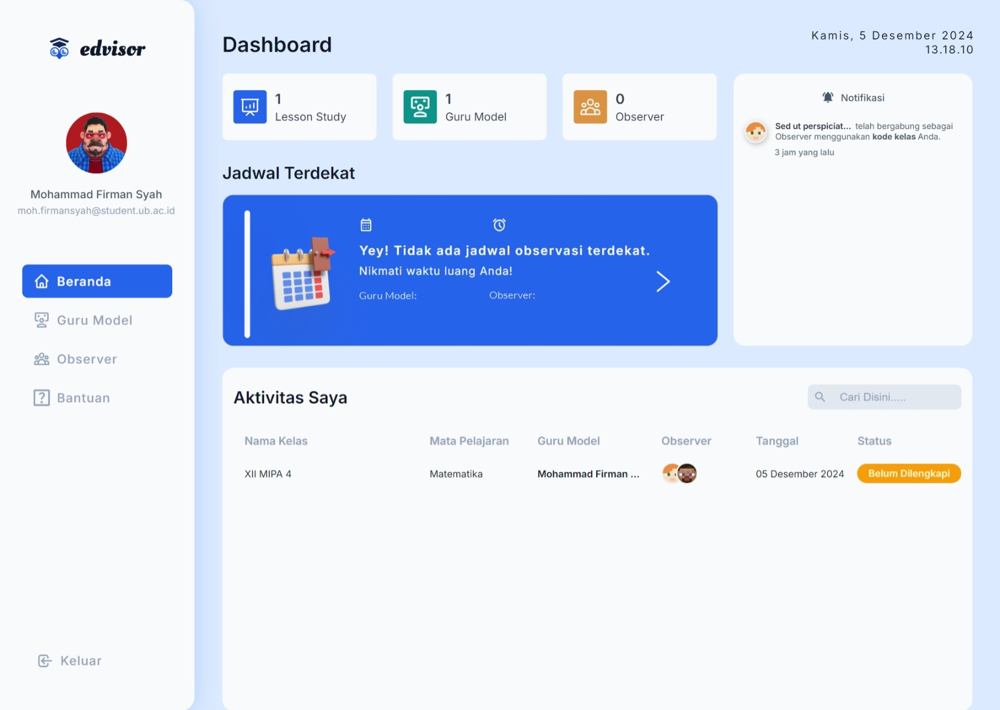
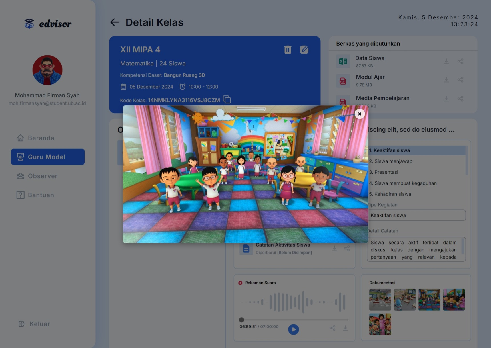
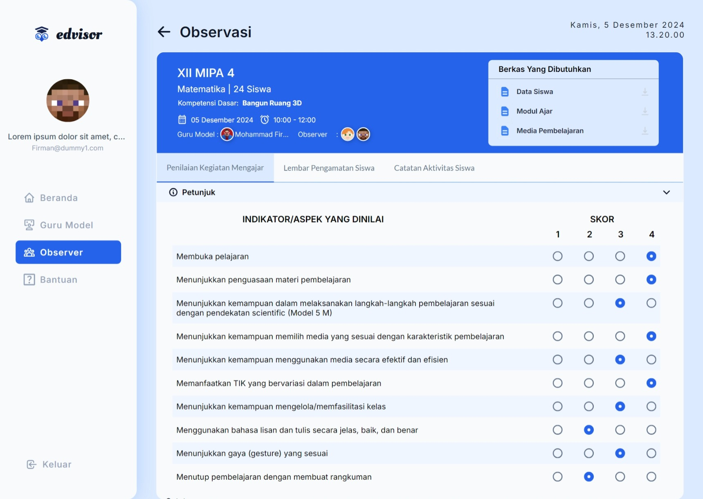

<h1><b>Edvisor Berbasis Website<b></h1>

## 📋 Daftar Isi

- [Deskripsi](#deskripsi)
- [Fitur](#fitur)
  - [Fitur yang Telah Diimplementasikan](#fitur-yang-telah-diimplementasikan)
  - [Fitur yang Belum Diimplementasikan](#fitur-yang-belum-diimplementasikan)
- [Instalasi](#instalasi)
- [Kontribusi](#kontribusi)
- [Dokumentasi](#dokumentasi)
  - [User Flow dan Class Diagram](#user-flow-dan-class-diagram)
  - [Screenshot Aplikasi](#screenshot-aplikasi)
- [Kredit](#kredit)
- [Lisensi](#lisensi)

## 📖 Deskripsi

Edvisor adalah aplikasi berbasis web yang dirancang untuk memfasilitasi pelaksanaan *lesson study* bagi mahasiswa dan supervisor. Aplikasi ini memungkinkan pengguna untuk membuat kelas guru model, mengundang anggota lain sebagai *observer*, serta bergabung ke kelas guru model menggunakan kode kelas. Fitur utama Edvisor meliputi pengisian formulir penilaian kegiatan mengajar, lembar pengamatan siswa, serta catatan aktivitas siswa yang dapat disimpan dan diunduh oleh guru model.

## 🚀 Fitur

### ✅ Fitur yang Telah Diimplementasikan

1. **Pembuatan Kelas Lesson Study**  
   Memungkinkan pengguna untuk membuat kelas khusus untuk *lesson study*.
   
2. **Penentuan Jadwal Lesson Study**  
   Menetapkan jadwal pelaksanaan *lesson study* saat pembuatan kelas.
   
3. **Penambahan Observer**  
   Menambahkan anggota *observer* saat membuat kelas.
   
4. **Penentuan Siswa yang Diamati**  
   Memilih siswa yang akan diamati oleh *observer*.
   
5. **Daftar Kelas Guru Model**  
   Menampilkan daftar kelas yang dibuat oleh guru model.
   
6. **Pengunggahan Berkas Kegiatan**  
   Mengunggah dokumen yang diperlukan untuk kegiatan *lesson study*.
   
7. **Penayangan Hasil Rekaman**  
   Melihat hasil rekaman kegiatan mengajar.
   
8. **Pembagian Kode Kelas**  
   Membagikan kode kelas untuk bergabung ke kelas *lesson study*.
   
9. **Daftar Kelas Observer**  
   Menampilkan daftar kelas yang diikuti oleh *observer*.
   
10. **Bergabung dengan Kelas Menggunakan Kode**  
    Memungkinkan pengguna untuk bergabung ke kelas dengan memasukkan kode kelas.
    
11. **Pelaksanaan Observasi dan Penilaian**  
    Mengisi formulir observasi dan penilaian kegiatan mengajar.
    
12. **Hasil Penilaian**  
    Melihat hasil penilaian yang telah diisi oleh *observer*.
    
13. **Pengunduhan Berkas Kegiatan**  
    Mengunduh dokumen yang diperlukan untuk kegiatan *lesson study*.
    
14. **Catatan dan Dokumentasi**  
    Melihat hasil catatan serta dokumentasi kegiatan.
    
15. **Akses Bantuan Penggunaan Aplikasi**  
    Menyediakan panduan penggunaan aplikasi.
    
16. **Profil Pengguna**  
    Melihat dan mengubah profil pengguna.

### 🕒 Fitur yang Belum Diimplementasikan

1. **Desain Antarmuka Responsif**  
   Meningkatkan tampilan agar responsif di berbagai perangkat.
   
2. **Opsi Pendaftaran untuk Supervisor**  
   Menambahkan fitur pendaftaran khusus untuk supervisor.
   
3. **Seleksi Login Berdasarkan Peran**  
   Menyediakan opsi login yang berbeda untuk akun supervisor dan mahasiswa.
   
4. **Halaman Penilaian Khusus Supervisor**  
   Membuat halaman penilaian yang eksklusif untuk supervisor.
   
5. **Formulir Penilaian untuk Supervisor**  
   Menambahkan formulir khusus bagi supervisor untuk melakukan penilaian.
   
6. **Penyesuaian Formulir Penilaian**  
   Mengadaptasi formulir penilaian dengan format terkini untuk supervisor dan mahasiswa.
   
7. **Penghapusan Input Dummy**  
   Menghapus input dummy seperti rekaman suara, file dokumentasi, dan catatan khusus dari controller.
   
8. **Integrasi API dengan Aplikasi Mobile**  
   Menghubungkan API Edvisor berbasis web dengan aplikasi mobile.
   
9. **Dukungan Mode Private Browser**  
   Menambahkan dukungan stabil untuk mode Private Browser, mengatasi kendala pada update heartbeat saat browser ditutup.

## 🛠 Instalasi

Berikut adalah langkah-langkah untuk menginstalasi Edvisor di localhost:

1. **Install XAMPP**  
   Unduh dan instal XAMPP versi PHP 8.2.12 dari [situs resmi XAMPP](https://www.apachefriends.org/index.html).

2. **Ekstrak File Edvisor**  
   Ekstrak file `Edvisor.7z` dan tempatkan dalam direktori `xampp/htdocs/`.

3. **Impor Database**  
   - Buka file `database.sql` dan salin seluruh query.
   - Buka browser dan navigasikan ke `http://localhost/phpmyadmin/index.php?route=/server/sql`.
   - Tempelkan query dalam tab SQL dan jalankan dengan menekan tombol `Go`.

4. **Jalankan Aplikasi**  
   Buka browser dan akses `http://localhost/edvisor/` untuk menguji aplikasi.

## 🤝 Kontribusi

Kontribusi untuk pengembangan Edvisor sangat kami hargai. Berikut adalah panduan untuk berkontribusi:

1. **Akses Controller**  
   Buka direktori `Edvisor/application/controllers/` untuk mengakses dan mengedit controller.

2. **Akses Model**  
   Buka direktori `Edvisor/application/models/` untuk mengakses dan mengedit model.

3. **Akses View**  
   Buka direktori `Edvisor/application/view/` untuk mengakses dan mengedit tampilan.

4. **Akses Assets**  
   Buka direktori `Edvisor/assets/` untuk mengakses dan mengelola aset seperti gambar, CSS, dan JavaScript.

## 📚 Dokumentasi

### 📈 User Flow dan Class Diagram

Kami telah menyediakan dokumentasi visual untuk memudahkan pemahaman alur pengguna dan struktur kelas dalam aplikasi:

#### User Flow

**Penjelasan User Flow:**

User Flow pada Edvisor mengilustrasikan alur interaksi pengguna dalam produk ini dengan dua peran utama: **Observer** dan **Guru Model**. Berikut adalah langkah-langkah interaksi pengguna:

1. **Memulai Interaksi:**
   Pengguna memulai dengan membuka aplikasi Edvisor dan diberikan pilihan untuk **mendaftar akun baru** atau **login** jika sudah memiliki akun.

2. **Login dan Akses Beranda:**
   Setelah berhasil login, pengguna akan diarahkan ke **beranda aplikasi**. Di beranda, pengguna dapat memilih untuk mendapatkan bantuan jika diperlukan.

3. **Pemilihan Peran:**
   Setelah mendapatkan bantuan, pengguna memiliki opsi untuk memilih peran sebagai **Observer** atau **Guru Model**.

   - **Sebagai Observer:**
     - Pengguna memilih untuk menjadi Observer dan melanjutkan dengan **bergabung ke dalam kelas** dengan memasukkan **kode kelas** yang diberikan oleh Guru Model.
     - Setelah bergabung, Observer akan **mengisi formulir observasi** yang berkaitan dengan kegiatan mengajar.
     - Proses ini selesai setelah formulir diisi dan disimpan.

   - **Sebagai Guru Model:**
     - Pengguna memilih untuk menjadi Guru Model dan melanjutkan dengan **membuat kelas baru** dengan mengisi detail kelas dan **mengunggah berkas** yang diperlukan.
     - Guru Model dapat **menentukan observer** yang akan berpartisipasi serta **memilih nomor siswa** yang akan diamati dalam kelas tersebut.
     - Sistem akan menghasilkan **kode kelas** yang dapat digunakan oleh Observer untuk bergabung.
     - Terakhir, Guru Model dapat **melihat hasil observasi** yang telah dilakukan oleh Observer.

Dengan alur ini, Edvisor memastikan bahwa kedua peran utama dapat berinteraksi secara efektif dalam mendukung pelaksanaan *lesson study*.

#### Class Diagram

**Penjelasan Class Diagram:**

Class Diagram pada Edvisor menggambarkan struktur data dan hubungan antar berbagai entitas dalam sistem. Berikut adalah penjelasan detail mengenai hubungan antar kelas:

1. **Users dan ci_sessions**
   - **Hubungan:** Users "1" --> "0..*" ci_sessions : has sessions
   - **Alasan:** Setiap pengguna (**Users**) dapat memiliki banyak sesi (**ci_sessions**). Ini memungkinkan sistem untuk melacak dan mengelola sesi pengguna secara individual, seperti login dan aktivitas pengguna.

2. **Users dan Classes**
   - **Hubungan:** Users "1" --> "0..*" Classes : creates classes
   - **Alasan:** Seorang pengguna (**Users**) yang berperan sebagai Guru Model dapat membuat banyak kelas (**Classes**). Kolom `creator_user_id` dalam tabel **Classes** merupakan foreign key yang merujuk ke `user_id` di tabel **Users**, yang menunjukkan siapa yang membuat kelas tersebut.

3. **Classes dan ClassObservers**
   - **Hubungan:** Classes "1" --> "0..*" ClassObservers : has observers
   - **Alasan:** Setiap kelas (**Classes**) dapat memiliki banyak pengamat (**ClassObservers**). Ini memungkinkan kelas tersebut untuk diikuti atau diamati oleh berbagai pengguna yang berperan sebagai pengamat.

4. **Users dan ClassObservers**
   - **Hubungan:** Users "1" --> "0..*" ClassObservers : becomes observer
   - **Alasan:** Seorang pengguna (**Users**) dapat menjadi pengamat (**ClassObservers**) untuk banyak kelas (**Classes**). Ini memungkinkan satu pengguna untuk mengamati berbagai kelas yang berbeda.

5. **Classes dan Notifications**
   - **Hubungan:** Classes "1" --> "0..*" Notifications : triggers notifications
   - **Alasan:** Setiap kelas (**Classes**) dapat memicu banyak notifikasi (**Notifications**). Notifikasi ini dapat berkaitan dengan berbagai aktivitas atau perubahan dalam kelas, seperti penambahan pengamat baru atau pembaruan materi pengajaran.

6. **Users dan Notifications**
   - **Hubungan:** Users "1" --> "0..*" Notifications : sends & receives notifications
   - **Alasan:** Seorang pengguna (**Users**) dapat mengirim dan menerima banyak notifikasi (**Notifications**). Kolom `sender_id` dan `receiver_id` dalam tabel **Notifications** masing-masing merujuk ke `user_id` di tabel **Users**, menunjukkan siapa yang mengirim dan menerima notifikasi tersebut.

7. **ClassObservers dan ObservedStudents**
   - **Hubungan:** ClassObservers "1" --> "0..*" ObservedStudents : observes students
   - **Alasan:** Setiap entri dalam **ClassObservers** (kombinasi antara kelas dan pengamat) dapat memiliki banyak siswa yang diamati (**ObservedStudents**). Ini menghubungkan pengamat dengan siswa yang mereka amati dalam kelas tertentu, memungkinkan pencatatan pengamatan secara terperinci.

8. **Classes dan TeachingActivityAssessment**
   - **Hubungan:** Classes "1" --> "0..*" TeachingActivityAssessment : has
   - **Alasan:** Setiap kelas (**Classes**) dapat memiliki banyak penilaian kegiatan mengajar (**TeachingActivityAssessment**). Ini memungkinkan pengamatan dan penilaian berbagai aspek pengajaran dalam satu kelas.

9. **ClassObservers dan TeachingActivityAssessment**
   - **Hubungan:** ClassObservers "1" --> "1" TeachingActivityAssessment : assesses
   - **Alasan:** Setiap pengamat dalam **ClassObservers** dapat melakukan satu penilaian kegiatan mengajar (**TeachingActivityAssessment**) untuk kelas yang diamatinya.

10. **Classes dan StudentObservationSheet**
    - **Hubungan:** Classes "1" --> "0..*" StudentObservationSheet : has
    - **Alasan:** Setiap kelas (**Classes**) dapat memiliki banyak lembar pengamatan siswa (**StudentObservationSheet**). Ini memungkinkan dokumentasi pengamatan siswa oleh pengamat secara sistematis.

11. **ClassObservers dan StudentObservationSheet**
    - **Hubungan:** ClassObservers "1" --> "1" StudentObservationSheet : observes
    - **Alasan:** Setiap pengamat dalam **ClassObservers** dapat mengisi satu lembar pengamatan siswa (**StudentObservationSheet**) untuk kelas yang diamatinya.

12. **StudentObservationSheet dan StudentObservationDetails**
    - **Hubungan:** StudentObservationSheet "1" --> "0..*" StudentObservationDetails : has
    - **Alasan:** Setiap lembar pengamatan siswa (**StudentObservationSheet**) dapat memiliki banyak detail pengamatan siswa (**StudentObservationDetails**). Ini memungkinkan pengamatan rinci terhadap berbagai indikator untuk setiap siswa.

13. **Classes dan StudentActivityNotes**
    - **Hubungan:** Classes "1" --> "0..*" StudentActivityNotes : has
    - **Alasan:** Setiap kelas (**Classes**) dapat memiliki banyak catatan aktivitas siswa (**StudentActivityNotes**). Catatan ini dapat mencakup berbagai aktivitas atau observasi yang dilakukan selama kelas berlangsung.

14. **ClassObservers dan StudentActivityNotes**
    - **Hubungan:** ClassObservers "1" --> "1" StudentActivityNotes : notes
    - **Alasan:** Setiap pengamat dalam **ClassObservers** dapat membuat satu catatan aktivitas siswa (**StudentActivityNotes**) untuk kelas yang diamatinya.

15. **Classes dan ClassVoiceRecordings**
    - **Hubungan:** Classes "1" --> "0..*" ClassVoiceRecordings : has
    - **Alasan:** Setiap kelas (**Classes**) dapat memiliki banyak rekaman suara (**ClassVoiceRecordings**). Rekaman ini dapat digunakan untuk mendokumentasikan aktivitas atau diskusi selama kelas.

16. **ClassObservers dan ClassVoiceRecordings**
    - **Hubungan:** ClassObservers "1" --> "1" ClassVoiceRecordings : notes
    - **Alasan:** Setiap pengamat dalam **ClassObservers** dapat membuat satu rekaman suara (**ClassVoiceRecordings**) untuk kelas yang diamatinya.

17. **Classes dan SpecialNotes**
    - **Hubungan:** Classes "1" --> "0..*" SpecialNotes : has
    - **Alasan:** Setiap kelas (**Classes**) dapat memiliki banyak catatan khusus (**SpecialNotes**). Catatan ini dapat mencakup hal-hal spesifik atau kejadian unik yang terjadi selama kelas berlangsung.

18. **ClassObservers dan SpecialNotes**
    - **Hubungan:** ClassObservers "1" --> "0..*" SpecialNotes : notes
    - **Alasan:** Setiap pengamat dalam **ClassObservers** dapat membuat banyak catatan khusus (**SpecialNotes**) untuk kelas yang diamatinya. Ini memungkinkan pengamat untuk mencatat hal-hal spesifik yang mereka amati dalam kelas.

19. **Classes dan ClassDocumentationFiles**
    - **Hubungan:** Classes "1" --> "0..*" ClassDocumentationFiles : documents
    - **Alasan:** Setiap kelas (**Classes**) dapat memiliki banyak file dokumentasi (**ClassDocumentationFiles**). File-file ini dapat berisi materi pengajaran, dokumentasi kegiatan, atau materi lainnya yang relevan dengan kelas.

20. **ClassObservers dan ClassDocumentationFiles**
    - **Hubungan:** ClassObservers "1" --> "0..*" ClassDocumentationFiles : documents
    - **Alasan:** Setiap pengamat dalam **ClassObservers** dapat mengunggah banyak file dokumentasi (**ClassDocumentationFiles**) untuk kelas yang diamatinya. Ini memungkinkan dokumentasi aktivitas pengamat dalam kelas secara terorganisir.

Dengan pemahaman struktur dan hubungan antar kelas ini, pengembang dapat lebih mudah dalam melakukan pengembangan dan pemeliharaan aplikasi Edvisor.

### 📸 Screenshot Aplikasi

Berikut adalah beberapa screenshot yang menggambarkan antarmuka dan fitur Edvisor:

1. **Login**  
   

2. **Beranda**  
   

3. **Kelas Guru Model**  
   

4. **Dokumentasi**  
   

5. **Preview Formulir**  
   

6. **Formulir**  
   

7. **Private Browsing**  
   

## 🎓 Kredit

### Pembina Proyek

- **Nama:** Ir. Retno Indah Rokhmawati, S.Pd., M.Pd.

### Developer

- **Nama:** Mohammad Firman Syah  
- **Program Studi:** Pendidikan Teknologi Informasi  
- **NIM:** 205150600111011  
- **Dirilis:** 2024

### Desain Antarmuka

- **Nama:** Moch. Rizal Effendi  
- **Program Studi:** Pendidikan Teknologi Informasi  
- **NIM:** 156150601111003  
- **Dirilis:** 2023

## 📄 Lisensi

Edvisor adalah perangkat lunak tertutup (*Closed Source Software*). Semua hak cipta dan hak kekayaan intelektual lainnya dilindungi.

---

Dibuat dengan ❤️ menggunakan [CodeIgniter 3.13](https://codeigniter.com/)