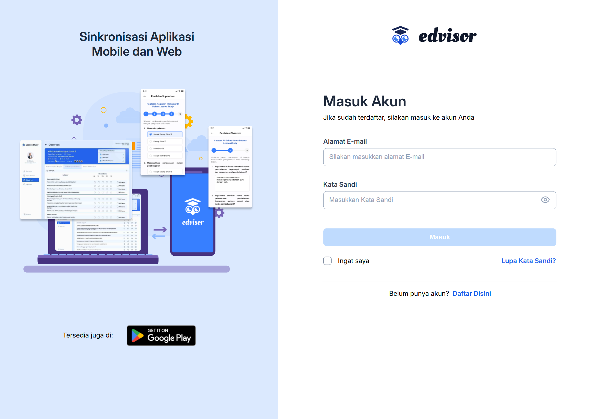
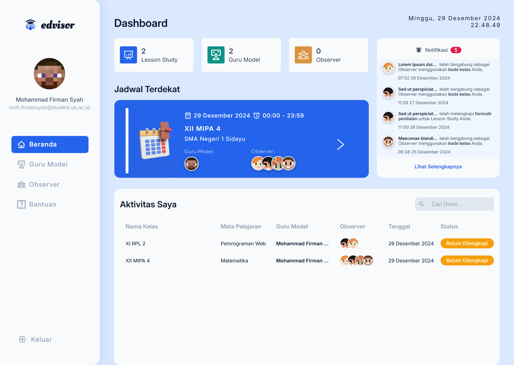
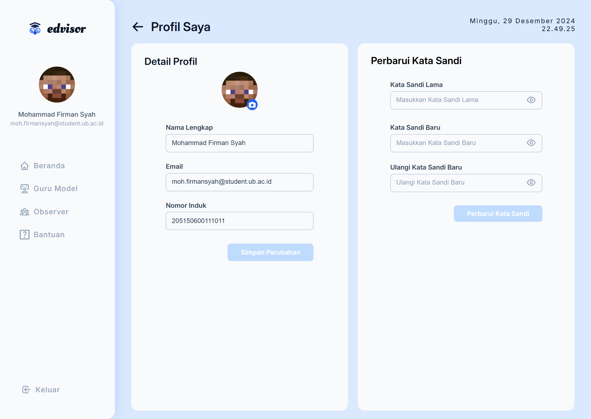
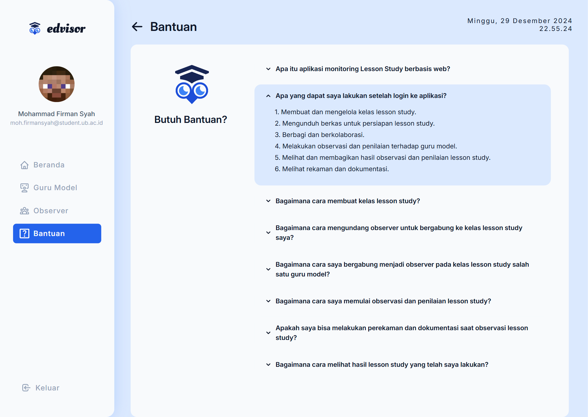

<div align="center">
  <h1><b>Edvisor Berbasis Website</b></h1>

  

<p>
  <!-- Latest Release (warna informational) -->
  <a href="https://github.com/mohammadfirmansyah/Edvisor/releases/latest"></a>
  <!-- Latest Status (placeholder kosong) -->
  <a href="https://github.com/mohammadfirmansyah/Edvisor/releases/latest"></a>
  <!-- Latest Update (placeholder kosong, warna lightgrey) -->
  <a href="https://github.com/mohammadfirmansyah/Edvisor/releases/latest"></a>
</p>
</div>

<h2 id="daftar-isi">📋 Daftar Isi</h2>

- [Deskripsi](#deskripsi)
  - [Format Penomoran Versi](#format-penomoran-versi)
- [Fitur](#fitur)
  - [Fitur yang Telah Diimplementasikan](#fitur-yang-telah-diimplementasikan)
  - [Fitur yang Belum Diimplementasikan](#fitur-yang-belum-diimplementasikan)
- [Instalasi](#instalasi)
  - [Instalasi menggunakan localhost](#instalasi-menggunakan-localhost)
  - [Instalasi menggunakan localTunnel](#instalasi-menggunakan-localtunnel)
  - [Instalasi menggunakan localToNet](#instalasi-menggunakan-localtonet)
- [Kontribusi](#kontribusi)
- [Dokumentasi](#dokumentasi)
  - [User Flow dan Class Diagram](#user-flow-dan-class-diagram)
  - [Screenshot Aplikasi](#screenshot-aplikasi)
- [Kredit](#kredit)
- [Lisensi](#lisensi)

<h2 id="deskripsi">📖 Deskripsi</h2>

Edvisor adalah aplikasi berbasis web yang dirancang untuk memfasilitasi pelaksanaan *lesson study* bagi mahasiswa dan supervisor. Aplikasi ini memungkinkan pengguna untuk membuat kelas guru model, mengundang anggota lain sebagai *observer*, serta bergabung ke kelas guru model menggunakan kode kelas. Fitur utama Edvisor meliputi pengisian formulir penilaian kegiatan mengajar, lembar pengamatan siswa, serta catatan aktivitas siswa yang dapat disimpan dan diunduh oleh guru model.

### Format Penomoran Versi

Untuk mengelola pengembangan dan pembaruan Edvisor secara sistematis, kami menerapkan <a href="https://semver.org/" target="_blank">Semantic Versioning</a>. Metode ini memudahkan dalam melacak perubahan, kompatibilitas, dan rilis fitur baru. Berikut adalah rincian format penomoran versi yang kami gunakan:

| Komponen       | Keterangan                                                                                                                                                                                                                                                                                                                                                                              |
|----------------------|------------------------------------------------------------------------------------------------------------------------------------------------------------------------------------------------------------------------------------------------------------------------------------------------------------------------------------------------------------------------------------------|
| **Digit 1**  | **Versi Major**: Menandakan perubahan besar yang mungkin tidak kompatibel dengan versi sebelumnya (breaking changes). Contohnya termasuk perubahan arsitektur atau penghapusan fitur lama.                                                                                                                                                                                                   |
| **Digit 2**  | **Versi Minor**: Menunjukkan penambahan fitur baru yang kompatibel dengan versi sebelumnya. Perubahan ini meningkatkan fungsionalitas tanpa mengganggu kestabilan sistem.                                                                                                                                                                                                                  |
| **Digit 3**  | **Versi Patch**: Menandakan perbaikan bug kecil atau peningkatan keamanan yang tidak mempengaruhi fungsionalitas utama aplikasi.                                                                                                                                                                                                                                                               |
| **Label Prerelease** | Menandakan status pengembangan versi yang belum stabil. Terdapat empat kategori utama:<br>- **Alpha**: Versi awal untuk pengujian internal.<br>- **Beta**: Versi setelah alpha yang siap diuji oleh kelompok pengguna terbatas.<br>- **Release Candidate (RC)**: Versi yang hampir stabil, menunggu pengujian akhir.<br>- **Release**: Versi stabil yang siap digunakan secara luas. |
| **Label Khusus** | Menandakan rilis khusus dalam konteks pengembangan seperti:<br>- **Hotfix**: Perbaikan cepat pada masalah kritis di versi produksi tanpa menunggu rilis berikutnya.<br>- **Security Patch**: Tambalan keamanan untuk mengatasi kerentanan.<br>- **Maintenance Release**: Rilis perawatan rutin untuk meningkatkan stabilitas dan kinerja.<br>- **Rollback**: Rilis yang mengembalikan perubahan karena adanya masalah serius. |
| **Nomor** | Menandakan urutan iterasi dari setiap rilis (prerelease atau label khusus). Contoh: `.1`, `.2`, `.3`, dll. |

**Contoh Penomoran Versi:**

- `1.0.0-alpha.1`: Versi awal dengan perubahan besar yang masih dalam tahap pengembangan pertama.
- `1.0.0-alpha.2`: Pembaruan pada versi alpha pertama.
- `1.0.0-beta.1`: Versi beta pertama setelah alpha, siap untuk pengujian lebih luas.
- `1.1.0-beta.2`: Penambahan fitur baru pada versi minor dengan revisi beta kedua.
- `1.1.0-rc.1`: Release Candidate pertama sebelum rilis final.
- `1.1.0`: Rilis final yang stabil dan siap digunakan secara luas.
- `1.1.0-hotfix.1`: Rilis khusus hotfix untuk memperbaiki masalah kritis pada versi 1.1.0.
- `2.0.0`: Versi major kedua dengan perubahan signifikan dan kemungkinan tidak kompatibel dengan versi sebelumnya.

**Panduan Penerapan Penomoran Versi:**

1. **Penambahan Fitur Baru:**
   - Tingkatkan **Minor** versi.
   - Contoh: Dari `1.0.0` menjadi `1.1.0`.

2. **Perbaikan Bug atau Peningkatan Kecil:**
   - Tingkatkan **Patch** versi.
   - Contoh: Dari `1.1.0` menjadi `1.1.1`.

3. **Perubahan Besar atau Tidak Kompatibel:**
   - Tingkatkan **Major** versi.
   - Contoh: Dari `1.1.0` menjadi `2.0.0`.

4. **Rilis Prerelease (Alpha, Beta, RC):**
   - Tambahkan label prerelease dengan nomor urut.
   - Contoh: `1.1.0-beta.1`, `1.1.0-beta.2`, hingga `1.1.0-rc.1`.

5. **Rilis Label Khusus (Hotfix, Security Patch, dsb.):**
   - Tambahkan label khusus dengan nomor urut.
   - Contoh: `1.1.0-hotfix.1`, `1.1.0-securitypatch.1`.

6. **Rilis Final:**
   - Hilangkan label prerelease atau label khusus setelah mencapai stabilitas.
   - Contoh: Dari `1.1.0-rc.1` menjadi `1.1.0`.

Dengan mengikuti format penomoran versi ini, kami memastikan bahwa setiap rilis Edvisor dapat dilacak dengan jelas, memudahkan pengguna dan pengembang dalam memahami tingkat perubahan dan kompatibilitas antar versi.

<h2 id="fitur">🚀 Fitur</h2>

<h3 id="fitur-yang-telah-diimplementasikan">✅ Fitur yang Telah Diimplementasikan</h3>

1. **Mendaftar Akun**  
   Pengguna dapat membuat akun baru untuk mengakses semua fitur yang tersedia dalam aplikasi Edvisor.

2. **Mengirim Kata Sandi Baru**  
   Pengguna dapat meminta penggantian kata sandi melalui email, di mana sistem akan mengirimkan kata sandi baru yang telah digenerasikan.

3. **Masuk Akun**  
   Pengguna dapat masuk ke akun mereka menggunakan email dan kata sandi yang telah didaftarkan.

4. **Melihat Beranda**  
   Setelah masuk, pengguna diarahkan ke halaman beranda yang menampilkan informasi utama dan navigasi aplikasi.

5. **Melihat Notifikasi**  
   Pengguna dapat melihat notifikasi terkait aktivitas terbaru dan pembaruan dalam aplikasi.

6. **Melihat Jadwal Terdekat**  
   Menampilkan jadwal kegiatan atau lesson study yang akan datang bagi pengguna.

7. **Melihat Aktivitas Pengguna**  
   Pengguna dapat melihat kombinasi jadwal kelas Guru Model dan kelas Observer yang telah mereka ikuti.

8. **Melihat Jumlah Kelas**  
   Menampilkan jumlah kelas yang dimiliki oleh Guru Model dan Observer yang terdaftar.

9. **Mengakses Bantuan Penggunaan Aplikasi**  
   Pengguna dapat mengakses panduan dan bantuan penggunaan aplikasi untuk memaksimalkan pengalaman mereka.

10. **Melihat Profil Pengguna**  
    Pengguna dapat melihat informasi profil mereka, termasuk detail pribadi dan foto profil.

11. **Memperbarui Foto Profil**  
    Pengguna dapat mengubah foto profil mereka untuk mencerminkan identitas visual mereka.

12. **Memperbarui Data Profil Pengguna**  
    Pengguna dapat memperbarui informasi profil mereka seperti nama lengkap, email, dan nomor induk.

13. **Memperbarui Kata Sandi**  
    Pengguna dapat mengganti kata sandi mereka untuk meningkatkan keamanan akun.

14. **Membuat Kelas Guru Model**  
    Guru Model dapat membuat kelas baru dengan menentukan detail kelas, mengunggah berkas, menambahkan Observer, dan menetapkan nomor siswa.

15. **Menentukan Detail Lesson Study**  
    Guru Model dapat mengatur nama kelas, nama sekolah, mata pelajaran, kompetensi dasar, tanggal, jam mulai, dan jam selesai untuk setiap lesson study.

16. **Mengunggah Berkas**  
    Guru Model dapat mengunggah berkas data siswa, modul ajar, dan media pembelajaran yang dapat diakses oleh Observer.

17. **Menambahkan Observer**  
    Guru Model dapat menambahkan Observer ke dalam kelas mereka untuk melakukan observasi dan penilaian.

18. **Menetapkan Nomor Siswa**  
    Guru Model dapat menentukan nomor siswa yang akan diamati oleh Observer dalam kelas.

19. **Membagikan Kode Kelas**  
    Guru Model dapat membagikan kode kelas kepada Observer lain yang ingin bergabung ke kelas mereka.

20. **Melihat Daftar Kelas Guru Model**  
    Guru Model dapat melihat semua kelas yang telah mereka buat dan kelola.

21. **Membuka Kelas Guru Model**  
    Guru Model dapat membuka kelas yang telah dibuat untuk melihat hasil observasi dan aktivitas lainnya.

22. **Memperbarui Data Kelas Guru Model**  
    Guru Model dapat memperbarui informasi kelas, termasuk detail lesson study, berkas, Observer, dan nomor siswa.

23. **Memperbarui Detail Lesson Study**  
    Guru Model dapat mengubah detail kegiatan lesson study sesuai kebutuhan.

24. **Memperbarui Berkas**  
    Guru Model dapat mengganti atau memperbarui berkas yang telah diunggah sebelumnya untuk memastikan informasi terbaru.

25. **Memperbarui Observer**  
    Guru Model dapat menambahkan atau menghapus Observer dalam kelas mereka sesuai kebutuhan.

26. **Memperbarui Nomor Siswa**  
    Guru Model dapat mengubah nomor siswa yang telah ditetapkan untuk observasi.

27. **Menghapus Kelas Guru Model**  
    Guru Model memiliki kemampuan untuk menghapus kelas yang tidak lagi diperlukan.

28. **Melihat Hasil Rekaman**  
    Guru Model dapat melihat hasil rekaman kegiatan mengajar yang telah dilakukan oleh masing-masing Observer.

29. **Melihat Hasil Catatan**  
    Guru Model dapat melihat catatan yang telah dibuat oleh masing-masing Observer selama kegiatan lesson study.

30. **Melihat Hasil Dokumentasi**  
    Guru Model dapat mengakses dokumentasi kegiatan lesson study untuk referensi dan evaluasi lebih lanjut.

31. **Mengunduh Berkas untuk Guru Model**  
    Guru Model dapat mengunduh berkas yang telah diunggah untuk keperluan offline atau dokumentasi.

32. **Mengunduh Hasil Penilaian**  
    Guru Model dapat mengunduh hasil penilaian yang telah dilakukan oleh Observer.

33. **Melihat Hasil Penilaian Observer**  
    Guru Model dapat melihat hasil penilaian yang telah diisi oleh masing-masing Observer untuk setiap kelas.

34. **Melihat Daftar Kelas Observer**  
    Observer dapat melihat semua kelas yang mereka ikuti dan kelola.

35. **Bergabung ke Kelas Guru Model**  
    Observer dapat bergabung ke kelas Guru Model dengan memasukkan kode kelas yang diberikan.

36. **Mengisi Kode Kelas**  
    Observer dapat memasukkan kode kelas untuk proses bergabung ke dalam kelas yang diinginkan.

37. **Memilih Nomor Siswa**  
    Observer dapat memilih nomor siswa yang akan mereka amati dalam kelas yang telah bergabung.

38. **Membuka Kelas Observer**  
    Observer dapat membuka dan mengakses kelas yang telah mereka ikuti untuk melakukan observasi.

39. **Melakukan Observasi dan Penilaian**  
    Observer dapat melakukan observasi dan mengisi formulir penilaian terhadap kegiatan mengajar dalam kelas.

40. **Melihat Hasil Penilaian Pribadi**  
    Observer dapat melihat hasil penilaian yang telah mereka lakukan untuk setiap kelas.

41. **Mengunduh Berkas untuk Observer**  
    Observer dapat mengunduh berkas terkait kelas yang mereka ikuti untuk referensi dan dokumentasi.

42. **Kompatibilitas Akses Publik**  
    Memungkinkan akses publik ke aplikasi Edvisor yang berjalan di jaringan pribadi pengembang menggunakan [localTunnel](https://localtunnel.github.io/www/) dan [LocalToNet](https://localtonet.com/), memudahkan pengujian dan distribusi aplikasi dalam lingkungan jaringan pribadi.

43. **Timer pada Halaman Penilaian Formulir**  
    Menambahkan fitur timer yang secara otomatis menyimpan formulir penilaian dan menutup akses setelah waktu yang ditentukan, memastikan keteraturan dan keamanan dalam proses penilaian.

<h3 id="fitur-yang-belum-diimplementasikan">🕒 Fitur yang Belum Diimplementasikan</h3>

1. **Desain Antarmuka Responsif**  
   Meningkatkan tampilan agar responsif di berbagai perangkat.
   
2. **Opsi Pendaftaran untuk Supervisor**  
   Menambahkan fitur pendaftaran khusus untuk supervisor.
   
3. **Seleksi Login Berdasarkan Peran**  
   Menyediakan opsi login yang berbeda untuk akun supervisor dan mahasiswa.
   
4. **Halaman Penilaian Khusus Supervisor**  
   Membuat halaman penilaian yang eksklusif untuk supervisor.
   
5. **Formulir Penilaian untuk Supervisor**  
   Menambahkan formulir khusus bagi supervisor untuk melakukan penilaian.
   
6. **Penyesuaian Formulir Penilaian**  
   Mengadaptasi formulir penilaian dengan format terkini untuk supervisor dan mahasiswa.
   
7. **Penghapusan Input Dummy**  
   Menghapus input dummy seperti rekaman suara, file dokumentasi, dan catatan khusus dari controller.
   
8. **Integrasi API dengan Aplikasi Mobile**  
   Menghubungkan API Edvisor berbasis web dengan aplikasi mobile.
   
9. **Pengamanan CSRF**  
    Menambahkan mekanisme CSRF untuk meningkatkan keamanan sistem.

10. **Konfigurasi Pesan Logging**  
    Melakukan konfigurasi pesan logging di dalam controller dan model untuk memudahkan troubleshooting dan audit.

<h2 id="instalasi">🛠 Instalasi</h2>

### Instalasi menggunakan localhost

Berikut adalah langkah-langkah untuk menginstalasi Edvisor di localhost:

1. **Install XAMPP**  
   - Unduh dan instal XAMPP versi PHP 8.2.12 dari <a href="https://www.apachefriends.org/index.html" target="_blank">situs resmi XAMPP</a>.
   - Ikuti petunjuk instalasi untuk sistem operasi Anda.

2. **Aktifkan Apache dan MySQL**  
   - Buka **XAMPP Control Panel** setelah instalasi selesai.
   - Pada panel kontrol, klik tombol **Start** di sebelah **Apache** dan **MySQL** untuk memulai layanan tersebut.
   - Pastikan status kedua layanan berubah menjadi **Running**.

3. **Ekstrak File Edvisor**  
   - Ekstrak file `Edvisor.7z` dan tempatkan dalam direktori `xampp/htdocs/`.

4. **Impor Database**  
   - Buka file `database.sql` dan salin seluruh query.
   - Buka browser dan navigasikan ke [`http://localhost/phpmyadmin/`](http://localhost/phpmyadmin/index.php?route=/server/sql).
   - Klik tab **SQL**, tempelkan query yang telah disalin, dan jalankan dengan menekan tombol **Go**.

5. **Jalankan Aplikasi**  
   - Buka browser dan akses [`http://localhost/edvisor/`](http://localhost/edvisor/) untuk menguji aplikasi.

### Instalasi menggunakan localTunnel

Untuk memungkinkan akses publik ke aplikasi Edvisor yang berjalan di jaringan pribadi, Anda dapat menggunakan **localTunnel**. Berikut adalah langkah-langkah instalasinya:

1. **Pastikan Instalasi di Localhost Selesai**  
   - Pastikan Anda telah menyelesaikan semua tahapan instalasi Edvisor di localhost seperti pada langkah [Instalasi menggunakan localhost](#instalasi-menggunakan-localhost).

2. **Jalankan Apache dalam XAMPP dan Catat Port yang Digunakan untuk HTTP**  
   - Buka XAMPP Control Panel.
   - Jalankan Apache dan MySQL, kemudian catat port yang digunakan untuk HTTP (biasanya port 80).

3. **Buka Direktori Konfigurasi Aplikasi**  
   - Navigasikan ke direktori `xampp/htdocs/Edvisor/application/config` menggunakan File Explorer.

4. **Edit File 'config.php'**  
   - Buka file `config.php` menggunakan text editor favorit Anda.

5. **Definisikan Subdomain yang Ingin Digunakan sebagai Alamat Web Hosting**  
   - Pastikan subdomain yang dipilih unik agar bisa digunakan.
      
     ```php
     $localTunnelSubdomain = '[subdomain].loca.lt';
     ```

   - Contoh:
   
     ```php
     $localTunnelSubdomain = 'edvisorfilkomub.loca.lt';
     ```

6. **Buka Direktori Konfigurasi Virtual Hosts**  
   - Navigasikan ke direktori `xampp/apache/conf/extra/` menggunakan File Explorer.

7. **Edit File 'httpd-vhosts.conf'**  
   - Buka file `httpd-vhosts.conf` menggunakan text editor favorit Anda.

8. **Tambahkan Konfigurasi Virtual Hosts pada Baris Paling Bawah File `httpd-vhosts.conf`**  
   - Tambahkan kode berikut dengan mengganti `[port HTTP]` dan `[subdomain yang sudah didefinisikan]` sesuai dengan konfigurasi Anda:
   <br>

   ```apache
   <VirtualHost *:[port HTTP]>
       ServerName localhost
       DocumentRoot "C:/xampp/htdocs/"
       <Directory "C:/xampp/htdocs/">
           Options Indexes FollowSymLinks Includes ExecCGI
           AllowOverride All
           Require all granted
       </Directory>
   </VirtualHost>

   <VirtualHost *:[port HTTP]>
       ServerName [subdomain yang sudah didefinisikan].loca.lt
       DocumentRoot "C:/xampp/htdocs/edvisor"
       <Directory "C:/xampp/htdocs/edvisor">
           Options Indexes FollowSymLinks Includes ExecCGI
           AllowOverride All
           Require all granted
       </Directory>
   </VirtualHost>
   ```

   **Contoh:**

   ```apache
   <VirtualHost *:80>
       ServerName localhost
       DocumentRoot "C:/xampp/htdocs/"
       <Directory "C:/xampp/htdocs/">
           Options Indexes FollowSymLinks Includes ExecCGI
           AllowOverride All
           Require all granted
       </Directory>
   </VirtualHost>

   <VirtualHost *:80>
       ServerName edvisorfilkomub.loca.lt
       DocumentRoot "C:/xampp/htdocs/edvisor"
       <Directory "C:/xampp/htdocs/edvisor">
           Options Indexes FollowSymLinks Includes ExecCGI
           AllowOverride All
           Require all granted
       </Directory>
   </VirtualHost>
   ```

9. **Unduh dan Install Node.js Versi LTS dari Situs Resmi Node.js**  
   - Kunjungi <a href="https://nodejs.org/" target="_blank">situs resmi Node.js</a> dan unduh versi LTS terbaru.
   - Ikuti petunjuk instalasi untuk sistem operasi Anda.

10. **Buka Command Prompt**  
    - Tekan tombol `Windows + R`, ketik `cmd`, dan tekan `Enter` untuk membuka Command Prompt.

11. **Verifikasi Instalasi Node.js dan npm**  
    ```bash
    node -v
    npm -v
    ```
    Pastikan kedua perintah tersebut mengembalikan versi yang terinstal.

12. **Install localTunnel Secara Global**  
    - Jalankan perintah berikut di Command Prompt:
    <br>

    ```bash
    npm install -g localtunnel
    ```

13. **Verifikasi Instalasi localTunnel**  
    ```bash
    lt --version
    ```
    Pastikan **localTunnel** terinstal dengan benar.

14. **Jalankan localTunnel** 
    - Jalankan perintah berikut dengan mengganti [port HTTP] dan [subdomain] sesuai dengan konfigurasi Anda
    <br>
    
    ```bash
    lt --port [port HTTP] --subdomain [subdomain yang sudah didefinisikan]
    ```
    
    **Contoh:**

    ```bash
    lt --port 80 --subdomain edvisorfilkomub
    ```

    **Catatan:**  
    - `--port 80`: Menentukan port lokal yang akan diekspos.
    - `--subdomain edvisorfilkomub`: Menginginkan subdomain khusus. Namun, **localTunnel** secara gratis tidak menjamin ketersediaan subdomain tertentu. Jika subdomain yang diinginkan sudah digunakan, Anda mungkin perlu memilih subdomain lain.

15. **Uji Akses Publik melalui Browser dengan Menuliskan Subdomain dalam URL**  
    
    **Contoh URL:**
    ```bash
    https://edvisorfilkomub.loca.lt/
    ```

16. **Uji dengan Menggunakan Perangkat dan Jaringan yang Berbeda**  
    - Pastikan aplikasi Edvisor dapat diakses dari perangkat dan jaringan yang berbeda untuk memastikan kompatibilitas dan kestabilan akses publik.

17. **Pastikan Koneksi Internet Stabil**  
    - Pastikan internet pada jaringan pribadi Anda stabil agar tidak muncul error **502 Bad Gateway** saat diakses dari perangkat lain.

18. **Mengatasi Pesan Password Tunnel**  
    - Apabila muncul pesan `'To access the website, please enter the tunnel password below.'`, isi password tunnel dengan alamat IP jaringan pribadi Anda. Gunakan perintah `ipconfig` di Command Prompt untuk mendapatkan alamat IPv4 Anda, kemudian salin dan masukkan sebagai password.

    **Langkah-langkah:**
    1. Buka Command Prompt.
    2. Jalankan perintah: 

       ```bash
       ipconfig
       ```
    3. Cari bagian **IPv4 Address** dan salin alamatnya.
    4. Masukkan alamat IP tersebut sebagai password tunnel saat diminta.

### Instalasi menggunakan LocalToNet

Setelah berhasil menggunakan localTunnel, Anda juga dapat menggunakan <a href="https://localtonet.com/" target="_blank">LocalToNet</a> sebagai alternatif untuk membuat aplikasi Edvisor dapat diakses secara publik.

1. **Pastikan Instalasi di Localhost Selesai**
   - Pastikan langkah [Instalasi menggunakan localhost](#instalasi-menggunakan-localhost) telah selesai.

2. **Jalankan Apache dalam XAMPP dan Catat Port HTTP**
   - Buka XAMPP Control Panel.
   - Jalankan Apache dan MySQL, catat port HTTP (biasanya port 80).

3. **Buka Direktori Konfigurasi Aplikasi**
   - Navigasikan ke `xampp/htdocs/Edvisor/application/config`.

4. **Edit File 'config.php'**
   - Buka `config.php` menggunakan text editor favorit Anda.

5. **Definisikan Subdomain LocalToNet**
   ```php
   $localToNetSubdomain = '[subdomain].localto.net';
   ```
   
   **Contoh:**
   ```php
   $localToNetSubdomain = 'edvisorfilkomub.localto.net';
   ```

6. **Buka Direktori Konfigurasi Virtual Hosts**
   - Navigasikan ke `xampp/apache/conf/extra/`.

7. **Edit File 'httpd-vhosts.conf'**
   - Buka `httpd-vhosts.conf` menggunakan text editor favorit Anda.

8. **Tambahkan Konfigurasi Virtual Hosts**
   - Tambahkan kode berikut dengan mengganti `[port HTTP]` dan `[subdomain yang sudah didefinisikan]` sesuai dengan konfigurasi Anda:
   <br>

   ```apache
   <VirtualHost *:[port HTTP]>
       ServerName localhost
       DocumentRoot "C:/xampp/htdocs/"
       <Directory "C:/xampp/htdocs/">
           Options Indexes FollowSymLinks Includes ExecCGI
           AllowOverride All
           Require all granted
       </Directory>
   </VirtualHost>

   <VirtualHost *:[port HTTP]>
    ServerAdmin webmaster@localto.net
    ServerName [subdomain yang sudah didefinisikan].localto.net
    DocumentRoot "C:/xampp/htdocs/Edvisor"
    <Directory "C:/xampp/htdocs/Edvisor">
        Options Indexes FollowSymLinks Includes ExecCGI
        AllowOverride All
        Require all granted
    </Directory>
    ErrorLog "logs/[subdomain yang sudah didefinisikan].localto.net-error.log"
    CustomLog "logs/[subdomain yang sudah didefinisikan].localto.net-access.log" common
   </VirtualHost>
   ```

   **Contoh:**
   ```apache
   <VirtualHost *:80>
       ServerName localhost
       DocumentRoot "C:/xampp/htdocs/"
       <Directory "C:/xampp/htdocs/">
           Options Indexes FollowSymLinks Includes ExecCGI
           AllowOverride All
           Require all granted
       </Directory>
   </VirtualHost>

   <VirtualHost *:80>
    ServerAdmin webmaster@localto.net
    ServerName edvisorfilkomub.localto.net
    DocumentRoot "C:/xampp/htdocs/Edvisor"
    <Directory "C:/xampp/htdocs/Edvisor">
        Options Indexes FollowSymLinks Includes ExecCGI
        AllowOverride All
        Require all granted
    </Directory>
    ErrorLog "logs/edvisorfilkomub.localto.net-error.log"
    CustomLog "logs/edvisorfilkomub.localto.net-access.log" common
   </VirtualHost>
   ```

9. **Daftarkan akun di LocalToNet**
   - Daftar dan masuk melalui situs resmi <a href="https://localtonet.com/" target="_blank">LocalToNet</a>.

10. **Tambahkan Balance (Opsional)**
    - Menambah balance untuk meningkatkan bandwidth.

11. **Buka My Tunnels > HTTP**
    - Buka sidebar LocalToNet, lalu akses halaman Tunnel HTTP.
   
12. **Isi Formulir Tunnel**
    ```
    Process Type: Custom SubDomain
    Auth Token: Default
    Server: SG-Singapore
    SubDomain: [subdomain yang sudah didefinisikan]
    Domain: localto.net
    IP: 127.0.0.1
    Port: [port HTTP]
    ```

    **Contoh:**
    ```
    Process Type: Custom SubDomain
    Auth Token: Default
    Server: SG-Singapore
    SubDomain: edvisorfilkomub.localto.net
    Domain: localto.net
    IP: 127.0.0.1
    Port: 80
    ```

    Klik **Create**.

13. **Install LocalToNet Client**
    - Unduh dan instal aplikasi LocalToNet Client di perangkat Anda melalui situs resmi <a href="https://localtonet.com/download" target="_blank">LocalToNet</a>.

14. **Ekstrak dan Jalankan localtonet.exe**
    - Ekstrak berkas, kemudian jalankan `localtonet.exe`. Setelah dijalankan, Command Prompt akan muncul.

15. **Buka Halaman User Token**
    - Akses Halaman <a href="https://localtonet.com/usertoken" target="_blank">User Token</a> menggunakan browser.

16. **Salin Token Default**
    - Salin token, kemudian tempelkan di Command Prompt dan tekan **Enter**.

17. **Tunggu Status Tersambung**
    - Pastikan **Session Status** menjadi 'Connected'.

18. **Buka Halaman Tunnel di LocalToNet**
    - Akses Halaman <a href="https://localtonet.com/tunnel/http" target="_blank">Tunnel</a>, lalu klik tombol **Start** pada Tunnel yang dibuat.

19. **Tunggu Status Menjadi OK**
    - Pastikan **Status** pada Command Prompt menjadi 'OK'.

20. **Uji Halaman Web**

    **Contoh URL:**
    ```bash
    https://edvisorfilkomub.localto.net/
    ```

21. **Uji dengan Perangkat dan Jaringan Berbeda**  
    - Pastikan aplikasi Edvisor dapat diakses dari berbagai perangkat dan jaringan untuk memastikan kompatibilitas serta kestabilan akses publik.

22. **Pastikan Internet Stabil**
    - Pastikan koneksi internet Anda stabil agar akses pengguna tidak terganggu.

23. **Matikan Proteksi Akses Web pada Antivirus (Opsional)**
    - Apabila URL diblokir, matikan proteksi akses web pada antivirus pengguna.

<h2 id="kontribusi">🤝 Kontribusi</h2>

Kontribusi untuk pengembangan Edvisor sangat kami hargai. Berikut adalah panduan untuk berkontribusi:

1. **Akses Controller**  
   Buka direktori `Edvisor/application/controllers/` untuk mengakses dan mengedit controller.

2. **Akses Model**  
   Buka direktori `Edvisor/application/models/` untuk mengakses dan mengedit model.

3. **Akses View**  
   Buka direktori `Edvisor/application/view/` untuk mengakses dan mengedit tampilan.

4. **Akses Assets**  
   Buka direktori `Edvisor/assets/` untuk mengakses dan mengelola aset seperti gambar, CSS, dan JavaScript.

5. **Menampilkan console.log**  
   - Buka direktori `Edvisor/assets/js/hideConsole.js`
   - Ubah nilai variabel:

     ```javascript
     const hideLogs = true;
     ```

     Menjadi:

     ```javascript
     const hideLogs = false;
     ```
   
   Dengan perubahan ini, pesan `console.log` akan muncul pada console browser untuk memudahkan debugging.

6. **Menambahkan Aset Baru**  
   Untuk menambahkan aset baru ke dalam halaman view, tambahkan entri baru di direktori `Edvisor/application/config/assets.php`. Pastikan untuk mengikuti struktur yang sudah ada agar aset baru terintegrasi dengan baik dalam aplikasi.

7. **Mengubah Versi Aset**  
   Jika Anda telah mengubah data aset, sebelum merilisnya ke publik, Anda harus memperbarui nomor versi aset. Caranya:
   - Buka direktori `Edvisor/application/hook/GlobalAssetsInjector.php`
   - Ubah nilai variabel `$asset_version` sesuai format `MAJOR.MINOR.PATCH.BUILD`. Contohnya:

     ```php
     $asset_version = '1.2.3.4';
     ```
   
   - Jika diperlukan, juga perbarui variabel `$release_year` untuk mencerminkan tahun rilis terbaru.

   Pembaruan versi ini penting untuk memastikan bahwa pengguna mendapatkan versi aset yang terbaru dan menghindari masalah cache saat aset diperbarui.

8. **Menambahkan Komentar pada Kode**  
   Setelah menuliskan kode, jangan pernah lupa untuk menuliskan komentar. Komentar membantu Anda memahami tujuan dari kode yang telah ditambahkan ketika Anda melihat kembali di masa depan.  
   
   Contoh:
   
   ```javascript
   // Mengaktifkan logging untuk proses debugging
   const hideLogs = true;
   ```
   
   Dengan menambahkan komentar seperti di atas, Anda dapat dengan mudah mengingat fungsi dan alasan di balik perubahan kode tersebut, sehingga memudahkan pemeliharaan dan pengembangan lebih lanjut.

<h2 id="dokumentasi">📚 Dokumentasi</h2>

### User Flow dan Class Diagram

Kami telah menyediakan dokumentasi visual untuk memudahkan pemahaman alur pengguna dan struktur kelas dalam aplikasi:

#### User Flow


**Penjelasan User Flow:**

User Flow pada Edvisor menggambarkan alur interaksi pengguna dalam produk ini dengan dua peran utama: **Observer** dan **Guru Model**. Berikut adalah langkah-langkah interaksi pengguna:

1. **Memulai Interaksi:**
   - Pengguna membuka aplikasi Edvisor.
   - Pengguna diberikan pilihan untuk **Mendaftar Akun**, **Login**, atau **Lupa Kata Sandi**.

2. **Proses Pendaftaran, Login, atau Reset Kata Sandi:**
   - **Mendaftar Akun:**
     - Jika memilih **Mendaftar Akun**, pengguna akan melalui serangkaian langkah untuk mengisi data pendaftaran.
     - Setelah pendaftaran berhasil, pengguna diarahkan kembali ke halaman **Login**.
   - **Login:**
     - Pengguna yang sudah memiliki akun dapat langsung memilih opsi **Login**.
     - Setelah berhasil login, pengguna diarahkan ke **Halaman Beranda**.
   - **Lupa Kata Sandi:**
     - Jika memilih **Lupa Kata Sandi**, pengguna dapat meminta penggantian kata sandi.
     - Sistem akan mengirimkan kata sandi baru melalui email pengguna.

3. **Akses Beranda:**
   - Di **Halaman Beranda**, pengguna memiliki beberapa opsi:
     - Memilih peran sebagai **Guru Model**.
     - Memilih peran sebagai **Observer**.
     - Mengakses **Navigasi Utilitas** seperti **Bantuan** dan **Profil**.
   - **Opsi Bantuan:**
     - Jika memilih **Bantuan**, pengguna akan menerima panduan penggunaan aplikasi.
     - Setelah menerima panduan, proses berakhir.

4. **Pemilihan Peran:**
   - Pengguna memilih untuk menjadi **Guru Model** atau **Observer**.

   - **Sebagai Guru Model:**
     1. **Membuat Kelas Guru Model:**
        - Mengisi detail kelas, termasuk nama kelas, nama sekolah, mata pelajaran, kompetensi dasar, tanggal, jam mulai, dan jam selesai.
        - Mengunggah berkas data siswa, modul ajar, dan media pembelajaran.
        - Menambahkan **Observer** yang akan berpartisipasi dalam kelas.
        - Menetapkan nomor siswa yang akan diamati.
        - Menyimpan formulir yang telah diisi dan menyalin kode kelas.
        - Setelah menyimpan, pengguna kembali ke **Halaman Beranda**.
     2. **Melihat Hasil Observasi:**
        - Memilih kelas yang diinginkan dari daftar kelas yang telah dibuat.
        - Melihat hasil observasi yang dilakukan oleh **Observer**.
        - Mengunduh formulir observasi jika diperlukan.
        - Proses ini berakhir setelah hasil observasi dilihat.

   - **Sebagai Observer:**
     1. **Bergabung dengan Kelas Guru Model:**
        - Memasukkan **kode kelas** yang diberikan oleh **Guru Model**.
        - Memilih nomor siswa yang akan diamati dalam kelas tersebut.
        - Menyimpan formulir tersebut.
        - Setelah menyimpan, pengguna kembali ke **Halaman Beranda**.
     2. **Melakukan Observasi Kelas:**
        - Memilih kelas yang ingin diobservasi dari daftar kelas yang telah diikuti.
        - Mengisi formulir pengamatan yang relevan.
        - Menyimpan formulir pengamatan.
        - Menambahkan tanda tangan digital jika diperlukan.
        - Proses observasi ini berakhir setelah formulir disimpan.

5. **Mengakses Navigasi Utilitas:**
   - Selain memilih peran utama, pengguna dapat memilih untuk mengakses **Profil**.
     - **Profil:**
       - Pengguna dapat memperbarui kata sandi, data profil, atau foto profil mereka.
       - Setiap pembaruan ditandai dengan simbol **Process** dan diakhiri dengan simbol **Terminator** setelah pembaruan selesai dilakukan.
   - Jika memilih **Bantuan**, pengguna akan menerima panduan penggunaan aplikasi dan proses akan berakhir.

6. **Fitur Tambahan:**
   - **Timer pada Halaman Penilaian Formulir:**
     - Saat mengisi formulir penilaian, pengguna akan melihat timer yang menghitung waktu yang tersisa.
     - Setelah timer selesai, formulir akan secara otomatis disimpan dan akses formulir akan ditutup, memastikan keteraturan dan keamanan dalam proses penilaian.

Dengan alur ini, Edvisor memastikan bahwa kedua peran utama dapat berinteraksi secara efektif dalam mendukung pelaksanaan *lesson study*, serta memberikan kemudahan dalam navigasi dan pengelolaan data pengguna.

#### Class Diagram


**Penjelasan Class Diagram:**

Class Diagram pada Edvisor menggambarkan struktur data dan hubungan antar berbagai entitas dalam sistem. Berikut adalah penjelasan detail mengenai hubungan antar kelas:

1. **Users dan ci_sessions**
   - **Hubungan:** Users "1" --> "0..*" ci_sessions : has
   - **Alasan:** Setiap pengguna (**Users**) dapat memiliki banyak sesi (**ci_sessions**). Ini memungkinkan sistem untuk melacak dan mengelola sesi pengguna secara individual, seperti login dan aktivitas pengguna.

2. **Users dan Classes**
   - **Hubungan:** Users "1" --> "0..*" Classes : creates
   - **Alasan:** Seorang pengguna (**Users**) yang berperan sebagai Guru Model dapat membuat banyak kelas (**Classes**). Kolom `creator_user_id` dalam tabel **Classes** merujuk ke `user_id` di tabel **Users**, menunjukkan siapa yang membuat kelas tersebut.

3. **Classes dan ClassObservers**
   - **Hubungan:** Classes "1" --> "0..*" ClassObservers : has
   - **Alasan:** Setiap kelas (**Classes**) dapat memiliki banyak pengamat (**ClassObservers**). Ini memungkinkan kelas tersebut untuk diikuti atau diamati oleh berbagai pengguna yang berperan sebagai pengamat.

4. **Users dan ClassObservers**
   - **Hubungan:** Users "1" --> "0..*" ClassObservers : becomes observer
   - **Alasan:** Seorang pengguna (**Users**) dapat menjadi pengamat (**ClassObservers**) untuk banyak kelas (**Classes**). Ini memungkinkan satu pengguna untuk mengamati berbagai kelas yang berbeda.

5. **Classes dan Notifications**
   - **Hubungan:** Classes "1" --> "0..*" Notifications : triggers 
   - **Alasan:** Setiap kelas (**Classes**) dapat memicu banyak notifikasi (**Notifications**). Notifikasi ini berkaitan dengan berbagai aktivitas atau perubahan dalam kelas, seperti penambahan pengamat baru atau pembaruan materi pengajaran.

6. **Users dan Notifications**
   - **Hubungan:** Users "1" --> "0..*" Notifications : sends & receives
   - **Alasan:** Seorang pengguna (**Users**) dapat mengirim dan menerima banyak notifikasi (**Notifications**). Kolom `sender_id` dan `receiver_id` dalam tabel **Notifications** masing-masing merujuk ke `user_id` di tabel **Users**, menunjukkan siapa yang mengirim dan menerima notifikasi tersebut.

7. **ClassObservers dan ObservedStudents**
   - **Hubungan:** ClassObservers "1" --> "1..*" ObservedStudents : observes 
   - **Alasan:** Setiap entri dalam **ClassObservers** (kombinasi antara kelas dan pengamat) harus memiliki setidaknya satu siswa yang diamati (**ObservedStudents**). Ini menghubungkan pengamat dengan siswa yang mereka amati dalam kelas tertentu, memungkinkan pencatatan pengamatan secara terperinci.

8. **Classes dan TeachingActivityAssessment**
   - **Hubungan:** Classes "1" --> "0..*" TeachingActivityAssessment : has
   - **Alasan:** Setiap kelas (**Classes**) dapat memiliki banyak penilaian kegiatan mengajar (**TeachingActivityAssessment**). Ini memungkinkan pengamatan dan penilaian berbagai aspek pengajaran dalam satu kelas.

9. **ClassObservers dan TeachingActivityAssessment**
   - **Hubungan:** ClassObservers "1" --> "1" TeachingActivityAssessment : assesses
   - **Alasan:** Setiap pengamat dalam **ClassObservers** dapat melakukan satu penilaian kegiatan mengajar (**TeachingActivityAssessment**) untuk kelas yang diamatinya.

10. **Classes dan StudentObservationSheet**
    - **Hubungan:** Classes "1" --> "0..*" StudentObservationSheet : has
    - **Alasan:** Setiap kelas (**Classes**) dapat memiliki banyak lembar pengamatan siswa (**StudentObservationSheet**). Ini memungkinkan dokumentasi pengamatan siswa oleh pengamat secara sistematis.

11. **ClassObservers dan StudentObservationSheet**
    - **Hubungan:** ClassObservers "1" --> "1" StudentObservationSheet : observes
    - **Alasan:** Setiap pengamat dalam **ClassObservers** dapat mengisi satu lembar pengamatan siswa (**StudentObservationSheet**) untuk kelas yang diamatinya.

12. **StudentObservationSheet dan StudentObservationDetails**
    - **Hubungan:** StudentObservationSheet "1" --> "1..*" StudentObservationDetails : has
    - **Alasan:** Setiap lembar pengamatan siswa (**StudentObservationSheet**) harus memiliki setidaknya satu detail pengamatan siswa (**StudentObservationDetails**). Ini memungkinkan pengamatan rinci terhadap berbagai indikator untuk setiap siswa.

13. **Classes dan StudentActivityNotes**
    - **Hubungan:** Classes "1" --> "0..*" StudentActivityNotes : has
    - **Alasan:** Setiap kelas (**Classes**) dapat memiliki banyak catatan aktivitas siswa (**StudentActivityNotes**). Catatan ini mencakup berbagai aktivitas atau observasi yang dilakukan selama kelas berlangsung.

14. **ClassObservers dan StudentActivityNotes**
    - **Hubungan:** ClassObservers "1" --> "1" StudentActivityNotes : notes
    - **Alasan:** Setiap pengamat dalam **ClassObservers** dapat membuat satu catatan aktivitas siswa (**StudentActivityNotes**) untuk kelas yang diamatinya.

15. **Classes dan ClassVoiceRecordings**
    - **Hubungan:** Classes "1" --> "0..*" ClassVoiceRecordings : has
    - **Alasan:** Setiap kelas (**Classes**) dapat memiliki banyak rekaman suara (**ClassVoiceRecordings**). Rekaman ini digunakan untuk mendokumentasikan aktivitas atau diskusi selama kelas.

16. **ClassObservers dan ClassVoiceRecordings**
    - **Hubungan:** ClassObservers "1" --> "0..1" ClassVoiceRecordings : record
    - **Alasan:** Setiap pengamat dalam **ClassObservers** dapat membuat hingga satu rekaman suara (**ClassVoiceRecordings**) untuk kelas yang diamatinya. Hal ini memberikan fleksibilitas bagi pengamat untuk mendokumentasikan kelas tanpa harus membuat banyak rekaman.

17. **Classes dan SpecialNotes**
    - **Hubungan:** Classes "1" --> "0..*" SpecialNotes : has
    - **Alasan:** Setiap kelas (**Classes**) dapat memiliki banyak catatan khusus (**SpecialNotes**). Catatan ini mencakup hal-hal spesifik atau kejadian unik yang terjadi selama kelas berlangsung.

18. **ClassObservers dan SpecialNotes**
    - **Hubungan:** ClassObservers "1" --> "0..*" SpecialNotes : notes
    - **Alasan:** Setiap pengamat dalam **ClassObservers** dapat membuat banyak catatan khusus (**SpecialNotes**) untuk kelas yang diamatinya. Ini memungkinkan pengamat untuk mencatat hal-hal spesifik yang mereka amati dalam kelas.

19. **Classes dan ClassDocumentationFiles**
    - **Hubungan:** Classes "1" --> "0..*" ClassDocumentationFiles : documents
    - **Alasan:** Setiap kelas (**Classes**) dapat memiliki banyak file dokumentasi (**ClassDocumentationFiles**). File-file ini berisi materi pengajaran, dokumentasi kegiatan, atau materi lainnya yang relevan dengan kelas.

20. **ClassObservers dan ClassDocumentationFiles**
    - **Hubungan:** ClassObservers "1" --> "0..*" ClassDocumentationFiles : documents
    - **Alasan:** Setiap pengamat dalam **ClassObservers** dapat mengunggah banyak file dokumentasi (**ClassDocumentationFiles**) untuk kelas yang diamatinya. Ini memungkinkan dokumentasi aktivitas pengamat dalam kelas secara terorganisir.

Dengan pemahaman struktur dan hubungan antar kelas ini, pengembang dapat lebih mudah dalam melakukan pengembangan dan pemeliharaan aplikasi Edvisor.

<h3 id="screenshot-aplikasi">📸 Screenshot Aplikasi</h2>

Berikut adalah beberapa screenshot yang menggambarkan antarmuka dan fitur Edvisor:

1. **Login**  
   

2. **Beranda**  
   

3. **Profil**  
   

4. **Buat Kelas**  
   

5. **Kode Kelas**  
   

6. **Melihat Hasil Penilaian**  
   

7. **Formulir Penilaian**  
   

8. **Bantuan**  
   

<h2 id="kredit">🎓 Kredit</h2>

### Pelopor Inovasi dalam Pengembangan Proyek

- **Nama:** Ir. Retno Indah Rokhmawati, S.Pd., M.Pd.

### Developer

- **Nama:** Mohammad Firman Syah  
- **Program Studi:** Pendidikan Teknologi Informasi  
- **NIM:** 205150600111011  
- **Dirilis:** 2025

### Desain Antarmuka

- **Nama:** Moch. Rizal Effendi  
- **Program Studi:** Pendidikan Teknologi Informasi  
- **NIM:** 156150601111003  
- **Dirilis:** 2023

<h2 id="lisensi">📄 Lisensi</h2>

Edvisor adalah perangkat lunak tertutup (*Closed Source Software*). Semua hak cipta dan hak kekayaan intelektual lainnya dilindungi.

---

Dibuat dengan ❤️ menggunakan <a href="https://codeigniter.com/" target="_blank">CodeIgniter V3.13</a>